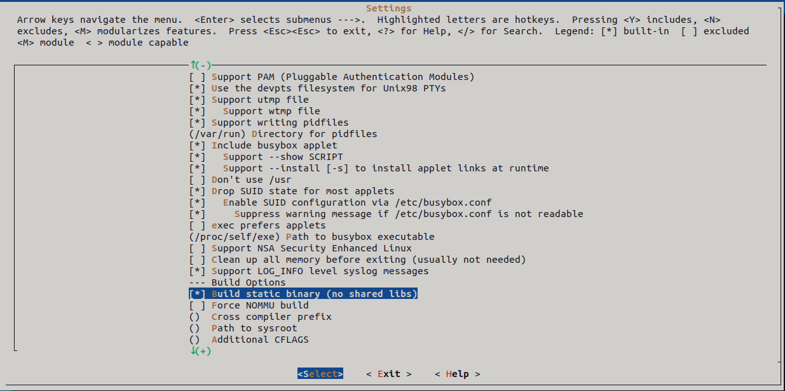
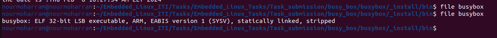
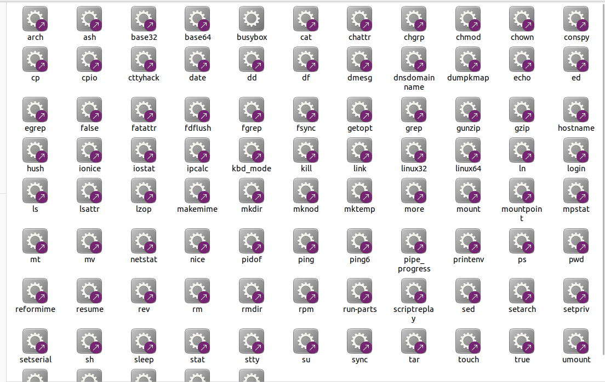
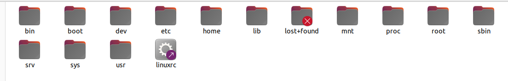
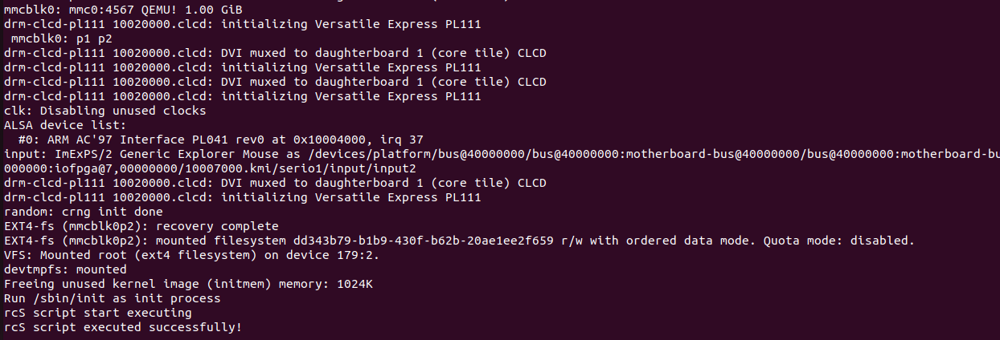
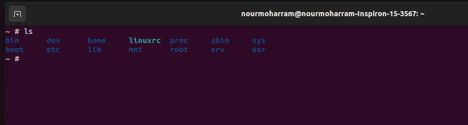

# Embedded_Linux_Tasks


### By Eng. Nour Alaa-Eldin Hanafy Moharram


# Task 9 :

## Create the binary executable files needed for the Root File System using Busy Box


## What is Busy Box :

##### BusyBox is a software suit which provides various common Unix utilities as single executable. The utilities are kept lightweight compare to their full version. It has been designed specially to make BusyBox light weight and to provide complete environment of small/embedded systems.


## A- Install BusyBox binaries for static compiled binaries :

> Static compiled mean that the generated binaries will be compiled with the essential required libraries needed in the run time so it will have larger size in memory space since the libraries files will be linked to the executable generated busybox

* clone the BusyBox repository

```bash
git clone https://github.com/mirror/busybox.git
cd busybox/
```

* create two global variables that will carry the tool chain compiler path and the system architecture

```bash
#in the make file (CROSS_COMPILEgcc)
export CROSS_COMPILE=arm-cortexa9_neon-linux-musleabihf-
export ARCH=arm
```

* open the menu configurations to configure the busy box to create the required binaries statically

```bash
make menuconfig
```




* build the busybox to create the executables required

```bash
#write make to build the busybox binary
make
#write make install to direct the generated symbolic links for the busy box to _install dir
make install
```

* the generated busy box is statically linked
* the binaries created are symbolic link the the busybox binary




* Create new directory in /home and name it Rootfs 

  * inside this directory create a sub directory name it staticRootfs
  * copy the content of _install directory in the busybox directory to the staticRootfs
  * create the other required directory for the root file system in the staticRootfs

  

* create the inittab and init.d directory inside the etc directory

  * inittab file : this file is fetched by the init process and the entries inside it will be executed

  ```bash
  # inittab file 
  #-------------------------------------------------------
  #When system startup,will execute "rcS" script
  ::sysinit:/etc/init.d/rcS
  #Start"askfirst" shell on the console (Ask the user firslty to press any key) 
  ttyAMA0::askfirst:-/bin/sh
  #when restarting the init process,will execute "init" 
  ::restart:/sbin/init
  #when shutting down run the rcX file
  ::shutdown:/etc/init.d/rcX
  ```

  

* create the init.d directory inside etc directory : this directory will hold the the scripts that will run using the entries in the inittab file

  * rcS shell script that will be executed at sysinit entry at startup

  ```shell
  #!/bin/sh
  
  echo "rcS script start executing"
  # mount a filesystem of type `proc` to /proc
  mount -t proc nodev /proc
  # mount a filesystem of type `sysfs` to /sys
  mount -t sysfs nodev /sys
  
  echo "rcS script executed successfully!"
  ```

  * rcX shell script that will be executed at shutdown entry

    ```sh
    #!/bin/sh
    echo rcX script is executing
    
    echo system is shutting down
    echo system is shutting down
    echo system is shutting down 
    
    echo rcX script finish executing
    
    echo see you next boot
    ```

  * change the permissions of the created scripts using the bash command below

    ```bash
    chmod +x ./etc/init.d/rcS
    chmod +x ./etc/init.d/rcX
    ```

    

* change the ownership of the staticRootfs directory using the command below

  ```bash
  cd ../
  sudo chown -R root:root staticRootfs
  ```

* copy the dynamic .ko files created for dynamic modules by kernel to the /lib directory in the staticRootfs

* copy the zImage and dtb file created for the boot to the boot partition of the sd card

* copy the content of the staticRootfs directory to the rootfs parition of the sd card

> the sd card used is a virtual sd card

* run the u-boot and set the bootargs environment variable as below :

```u-boot command
setenv bootargs 'console=ttyAMA0 root=/dev/mmcblk0p2 rootfstype=ext4 rw rootwait init=/sbin/init' 
saveenv
```

* run the QEMU environment to start running the kernel

```bash
qemu-system-arm -M vexpress-a9 -m 128M --nographic -kernel path/u-boot -sd path/sd.img
```






## B- Install BusyBox binaries for Dynamic compiled binaries :

> the same steps as used in static compiled binaries except the steps mentioned below

* disable the build static binary option in busybox menuconfig
* disable the use static libgcc option


* create sub directory named dynamicRootfs in the rootfs directory at /home

* copy the sysroot content (lib & usr) from the tool chain directory to the dynamicRootfs using command below

```bash
cd sysroot
sudo rsync -av * /home/nourmoharram/rootfs/dynamicRootfs
```

* clear the rootfs parition of the sd image and then copy the content of the dynamicRootfs to the rootfs parition (ext4)


## Notes related to BusyBox :

* In static compiled BusyBox binaries all the created binaries are symbolic link to the executable busy box and they not consume any space in memory while the busybox only consume memory (large memory)
* why statically busy box is having large size ?
  * because it has all the implemented binaries inside it in addition to any required static libraries from the cross tool chain since the binaries are compiled by this tool chain. 
  * without the busybox if we created the binaries stand alone for each one so every binary would have its needed static libraries linked with it and this will cause high memory consumption in ram
* In dynamic compiled busybox the binaries are also symbolic link to the busybox binary but it is not linked with any needed library from the tool chain libraries since they will be copied to the ram in a specific memory location to be located in run time by system loader (ld.so)
  * this approach will save alot of memory in ram since the binaries will consume one space and  the libraries needed will be loaded in run time to specific memory space in ram when their relative binaries are called or used 
