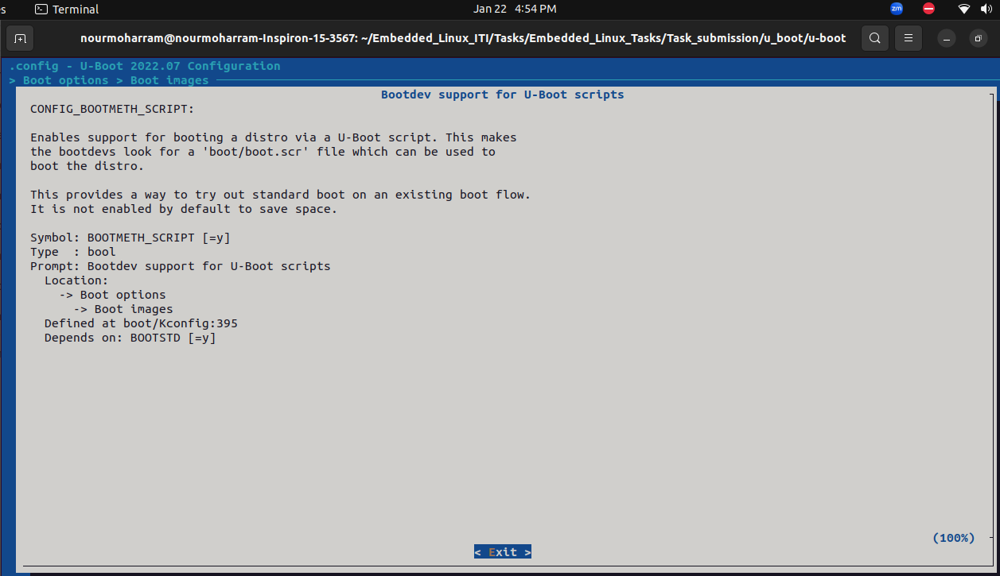
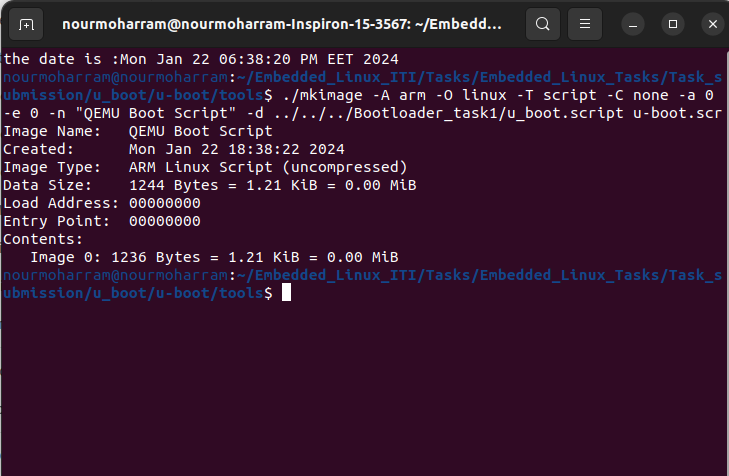
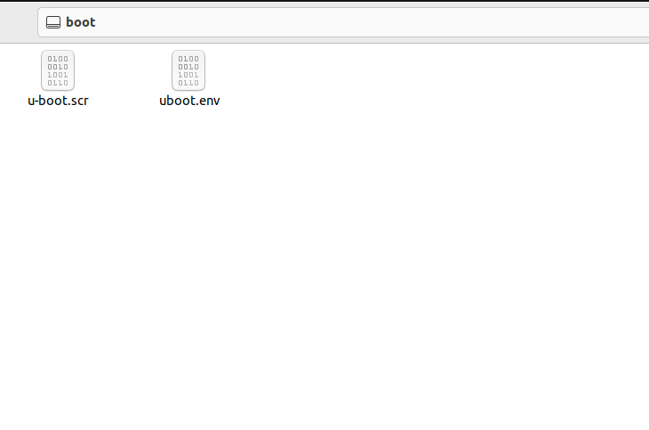
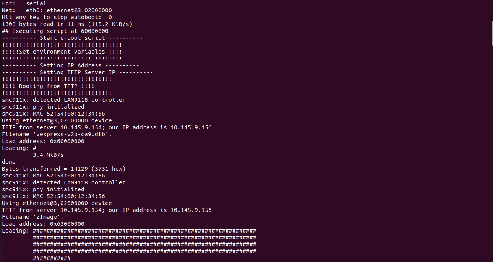
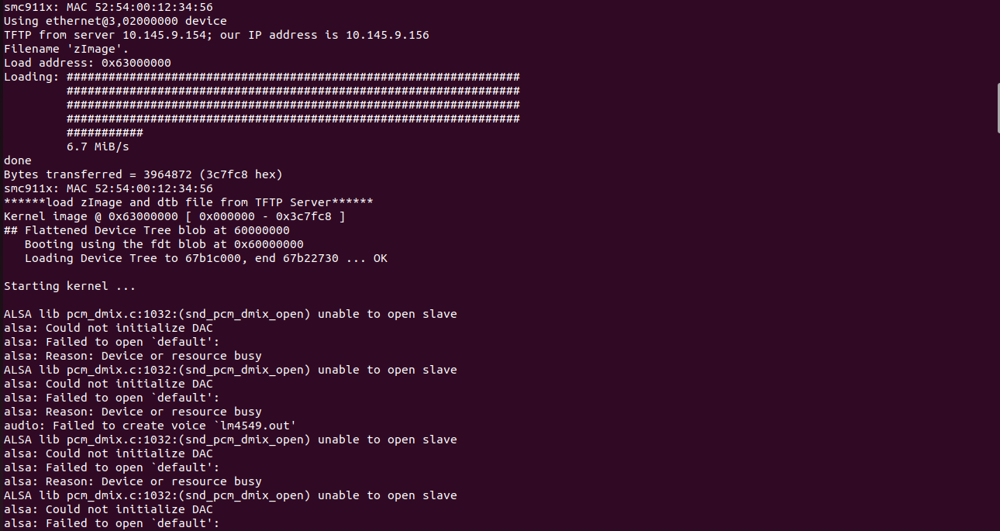

# Embedded_Linux_Tasks


### By Eng. Nour Alaa-Eldin Hanafy Moharram

## Create a Boot script for u-boot:

### the boot script shall do :

* set environment variables for Kernel start address and dtb file start address
* set the ip address for the target/QEMU and set the server address for TFTP server
* check for a environment variable called net_boot if it's found
  * it will check its value if == 1 then : u-boot will load zImage and dtb file from TFTP Server
  * if not will load zImage and dtp file from fat partition in virtual SD card
* if environment variable not found u-boot will boot kernel and dtb file from sd card normally
* at every condition and after loading the zImage and dtb file successfully the script will run the zImage to start Kernel 


### First : Enable the boot image option in the u-boot configurations



### Second : create an environment variable called scriptaddr and assign the start address where boot script will be loaded to it and write the load command to load the script from it at booting

```bash
setenv scriptaddr "0x60000000"
setenv bootcmd "fatload mmc 0:1 $scriptaddr u-boot.scr;source $scriptaddr"
```


### Third : Create a boot script file and write the script of booting

```bash
echo ---------- Start u-boot script ----------

echo !!!!!!!!!!!!!!!!!!!!!!!!!!!!!!!!!!!
echo !!!!!Set environment variables !!!!
echo !!!!!!!!!!!!!!!!!!!!!!!!!! !!!!!!!!
setenv DTB_ADDRESS "0x60000000"
setenv KERNEL_ADDRESS "0x63000000"

echo ---------- Setting IP Address ----------
setenv ipaddr 10.145.9.156

echo ---------- Setting TFTP Server IP ----------
setenv serverip 10.145.9.154

if test -n $net_boot; 
then 
  if itest $net_boot == 1; 
  then 
    echo !!!!!!!!!!!!!!!!!!!!!!!!!!!!!!!!;
    echo !!!!   Booting from TFTP    !!!!;
    echo !!!!!!!!!!!!!!!!!!!!!!!!!!!!!!!!;
    run load_from_tftp;
    echo ******load zImage and dtb file from TFTP Server******;
    bootz $KERNEL_ADDRESS - $DTB_ADDRESS;
  else 
    echo !!!!!!!!!!!!!!!!!!!!!!!!!!;
    echo !    Booting from SD     !;
    echo !!!!!!!!!!!!!!!!!!!!!!!!!!;
    run load_from_fat;
    echo ******load zImage and dtb file from SD Card******;
    bootz $KERNEL_ADDRESS - $DTB_ADDRESS;
  fi
else 
  echo !!!!!!!!!!!!!!!!!!!!!!!!!!;
  echo !!!!!No net boot found!!!!;
  echo !    Booting from SD     !; 
  echo !!!!!!!!!!!!!!!!!!!!!!!!!!;
  run load_from_fat;
  echo ******load zImage and dtb file from SD Card******;
  bootz $KERNEL_ADDRESS - $DTB_ADDRESS;
fi

```

### Fourth : using the mkimage utility from u-boot we will convert the boot script file to boot script image to be executed by u-boot

```bash
./mkimage -A arm -O linux -T script -C none -a 0 -e 0 -n "QEMU Boot Script" -d <path-to-bootscript>  <boot-script-file-name.scr>
```

* -A arm: Specifies the architecture. In this case, it's set to "arm."

* -O linux: Specifies the operating system. Here, it's set to "linux."

* -T script: Specifies the image type. In this case, it's set to "script" to indicate that the input file is a script.

* -C none: Specifies the compression type. In this case, it's set to "none" because scripts are typically not compressed.

* -a 0: Specifies the load address of the image. Here, it's set to "0," indicating that the script should be loaded at address 0.

* -e 0: Specifies the entry point of the image. Here, it's set to "0," indicating that the entry point is at address 0.

* -n "QEMU Boot Script": Specifies a descriptive name for the image. In this case, it's set to "QEMU Boot Script."

* -d <path-to-bootscript>: Specifies the input file (the script) to be included in the image. Replace <path-to-bootscript> with the actual path to your boot script file.

* <boot-script-file-name.scr>: Specifies the output file name for the U-Boot image. Replace <boot-script-file-name.scr> with the desired name for the output image file.



### Fifth : copy the u-boot.scr file to the fat partition of the sd card



### Sixth : run the QEMU environment!




