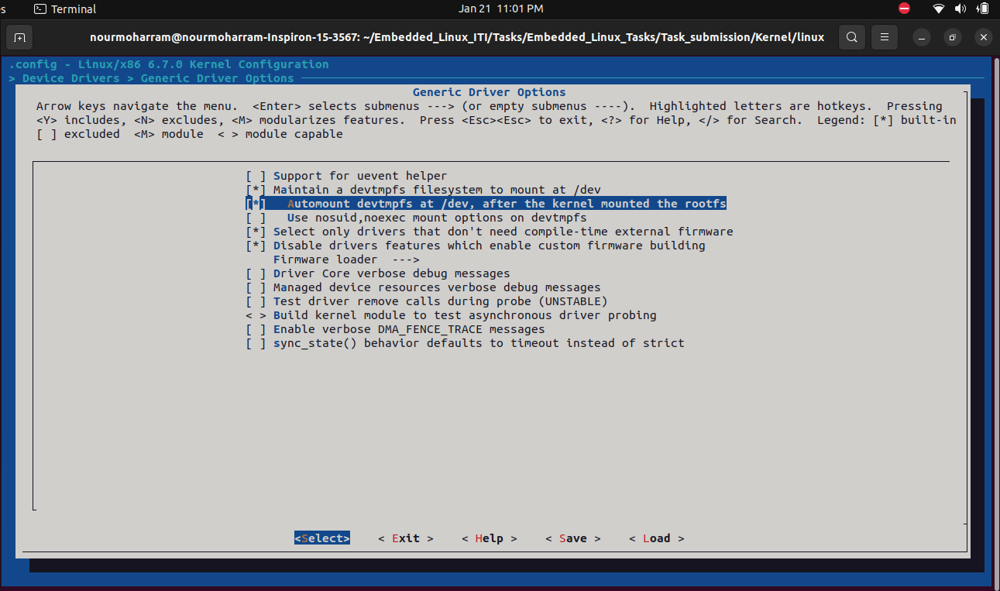
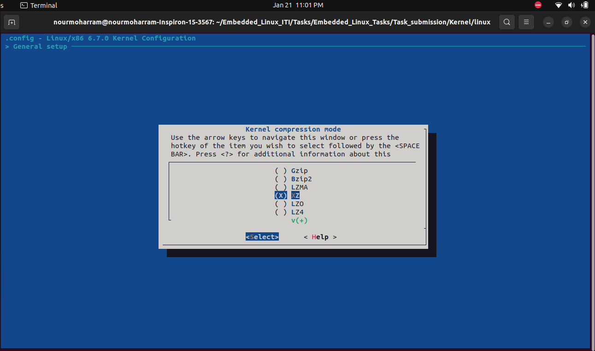
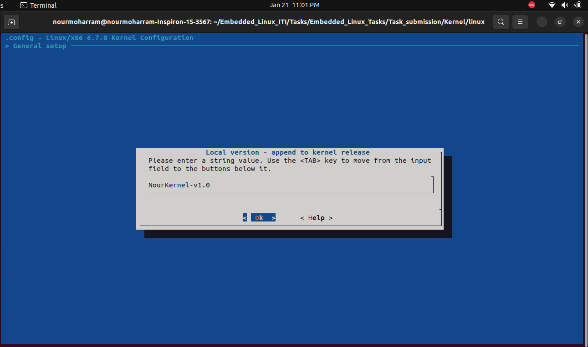
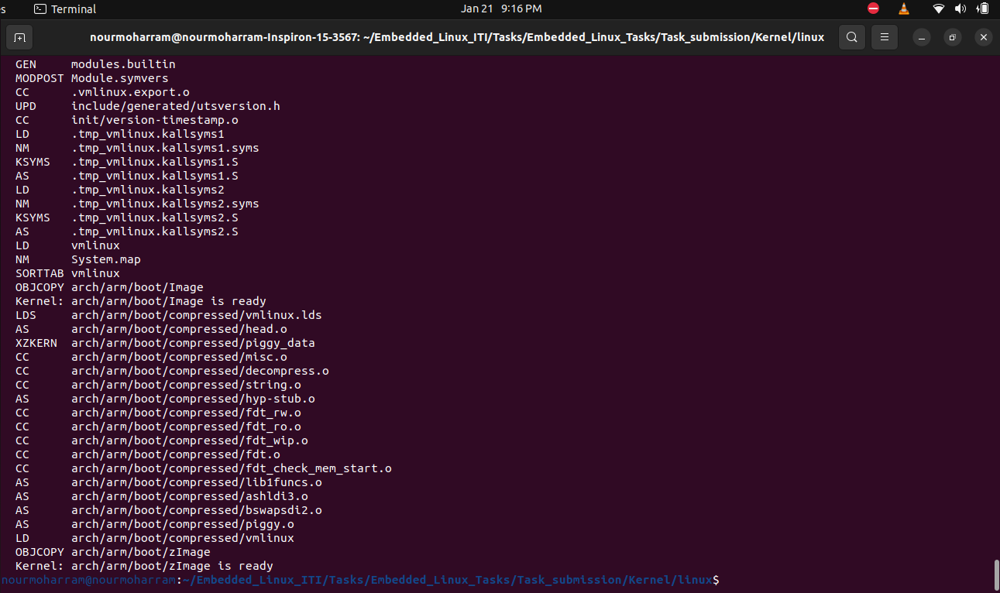
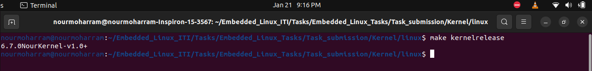
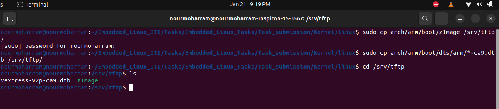
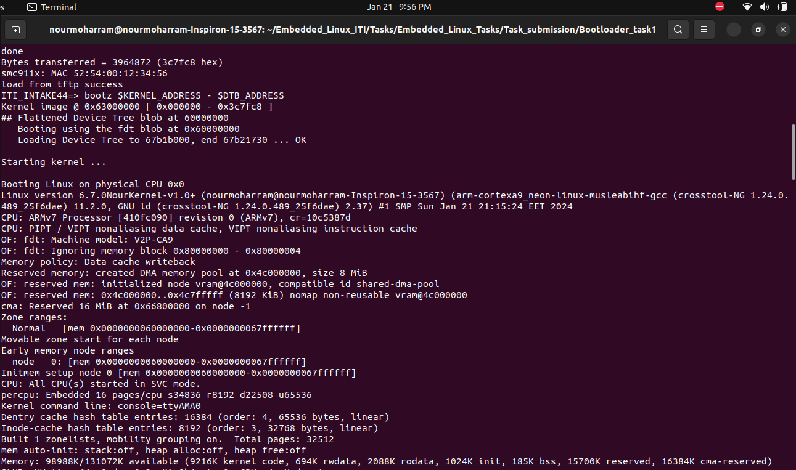
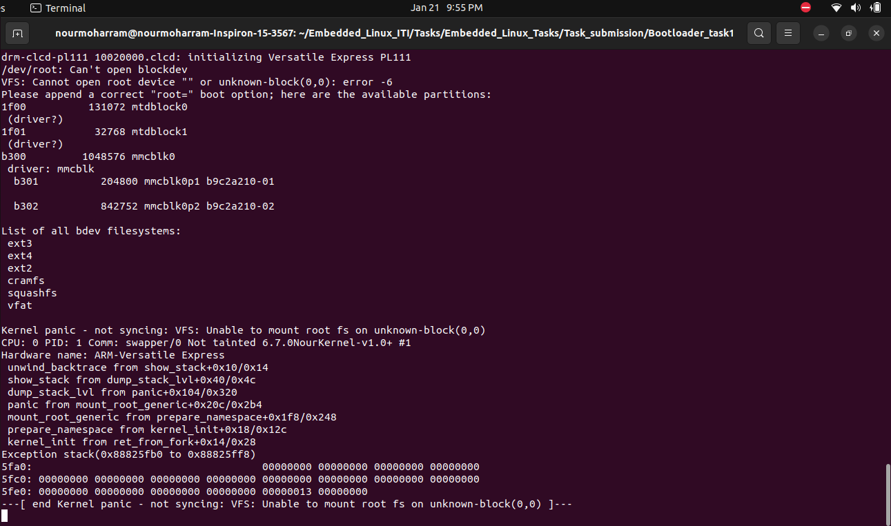

# Embedded_Linux_Tasks


### By Eng. Nour Alaa-Eldin Hanafy Moharram


## Embedded Linux Task 8:

## Create zImage for Kernel and transfer it along with target.dtb file over TFTP server


### Download the Linux Kernel files to configure it:

```bash
#clone the linux kernel files
git clone --depth=1 git://git.kernel.org/pub/scm/linux/kernel/git/stable/linux.git
#move to the linux directory
cd linux

#configure the kernel to vexpress
make ARCH=arm vexpress_defconfig

# To indentify your kernel version 
make ARCH=arm kernelversion
```


### Run the configurations menu to configure the below options:

```bash
make menuconfig
```

- Enable **devtmpfs**

#### what is devtmpfs ?

`devtmpfs` is a kernel-based, in-memory filesystem in Linux that dynamically manages device nodes in `/dev` during system boot. Device nodes in `/dev` represent interfaces between user-space applications and kernel drivers, allowing programs to interact with hardware. `devtmpfs` eliminates the need for userspace tools like `udev` by having the kernel handle device node creation. These nodes serve as standardized file-based communication points for accessing and controlling various hardware devices in Unix-like operating systems.



-  Change kernel compression to **XZ**

XZ uses the LZMA2 algorithm and instruction set specific BCJ filters which can improve compression ratio of executable code. 

Kernel Size Comparison:

When compared to the gzip compression format, XZ achieves a kernel size that is approximately 30% smaller.



-  Change your kernel local version to your name and append on it -v1.0




### Build the zImage after saving the configurations

```bash
make -j2 zImage modules dtbs
```

* make: This is the command used to build software from source code, and it is commonly used in Unix-like operating systems. In this context, it is specifically used for building the Linux kernel.

* -j2: This option specifies the number of jobs or processes that make should use simultaneously. In this case, -j2 indicates that up to 2 parallel jobs can be executed. This is often used to speed up the build process by taking advantage of multi-core processors.

* zImage: This is one of the targets for the make command. In the context of building the Linux kernel, zImage refers to the compressed kernel image that includes the bootloader code. This image is commonly used on older systems and some embedded platforms.

* modules: This target builds the loadable kernel modules. Kernel modules are pieces of code that can be loaded into the running kernel to add functionality or device support without requiring a reboot.

* dtbs: This target builds the device tree blobs (DTBs). Device tree is a data structure that describes the hardware in a system in a way that is agnostic to the architecture. The device tree blob is used by the bootloader to pass information about the hardware to the kernel





### Copy the zImage and vexpress-v2p-ca9.dtb file from the linux directory to the tftp server directory

```bash
cd ~/linux
sudo cp arch/arm/boot/zImage /srv/tftp/
sudo cp arch/arm/boot/dts/arm/*-ca9.dtb /srv/tftp/

```



### Run the QEMU Environment and load the zImage and vexpress-v2p-ca9.dtb file to the addresses below in RAM:

#### using the command bdinfo get the start address of RAM bank and its size then:

* Create environment variable called KERNEL_ADDRESS and its value 0x63000000
* Create environment variable called DTB_ADDRESS and its value 0x60000000
* load the zImage and dtb file to the relative addresses using the tftp <required_address> <file_name> command
* run bootz command to execute the zImage

```bash
setenv KERNEL_ADDRESS "0x63000000"
setenv DTB_ADDRESS "0x60000000"
saveenv
tftp $KERNEL_ADDRESS zImage
tftp $DTB_ADDRESS vexpress-v2p-ca9.dtb
bootargs console=ttyAMA0
bootz $KERNEL_ADDRESS - $DTB_ADDRESS

```

* bootargs console=ttyAMA0 : 
  * **`bootargs`**: This is an environment variable that holds the command-line arguments passed to the Linux kernel during boot. The `bootargs` variable is used to configure various parameters, such as console settings, root filesystem location, and other kernel options.
  * **`console=ttyAMA0`**: This is a specific parameter within the `bootargs` variable. In this case, it sets the console to use the serial port `ttyAMA0`. The console is the device where the kernel sends its output messages, and by setting it to a serial port, you can redirect the kernel messages to a serial console.






##### The reason of the Kernel Panic will be solved in the next readme file ...
